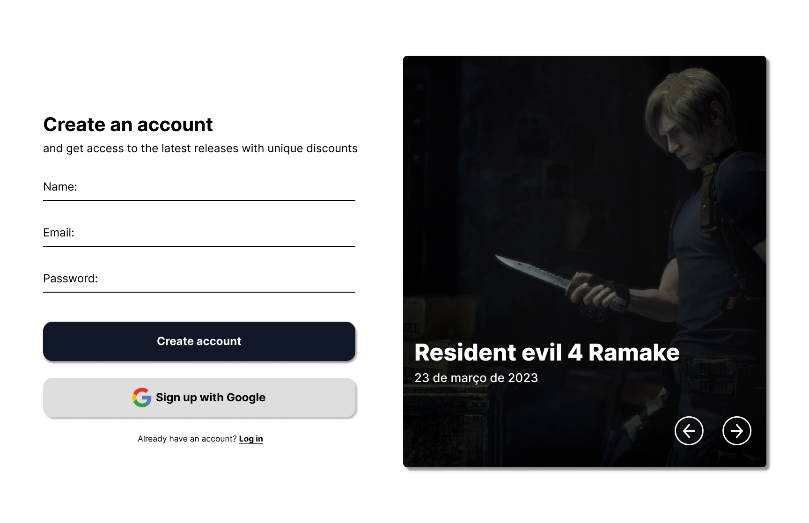

# Login Screen (Gamer Theme Minimalist) with Styled Components

Este projeto é uma refatoração da tela de login utilizando a biblioteca Styled Components. A proposta é comparar a implementação utilizando CSS puro com a abordagem de styled components, buscando entender as diferenças e vantagens de cada abordagem.

## Motivação

A motivação por trás desse projeto foi explorar e experimentar as capacidades do Styled Components. Ao utilizar essa biblioteca, pude organizar e estruturar melhor o código CSS da aplicação, tornando-o mais fácil de gerenciar e manter. Além disso, a utilização de props no Styled Components permitiu criar uma tela de login mais dinâmica e personalizável.

## Recursos Utilizados

- Styled Components: A biblioteca de estilização permite escrever CSS dentro dos componentes React, tornando o código mais legível e manutenível.
- Props: Utilizei as props do Styled Components para ajustar estilos de forma dinâmica, permitindo maior personalização da tela de login.
- useEffect: No que diz respeito à renderização das imagens, empreguei o hook useEffect para controlar o comportamento do slider. Além disso, adicionei uma lógica para pausar o slider caso a tela não possua espaço suficiente para exibi-lo adequadamente.
  
## Resultados

A refatoração utilizando Styled Components proporcionou uma tela de login mais organizada e ajustável. A separação de estilos por componente tornou o código mais modular e fácil de entender. Além disso, a utilização de props permitiu criar diferentes temas e estilos para a tela de login sem precisar duplicar código.

## Como Executar

Para executar o projeto localmente, siga os seguintes passos:

1. Clone o repositório para o seu ambiente local.
2. Certifique-se de ter o Node.js instalado em sua máquina.
3. No terminal, navegue até a pasta do projeto e execute o comando `npm install` para instalar as dependências.
4. Após a instalação das dependências, execute o comando `npm start` para iniciar a aplicação em modo de desenvolvimento.
5. Acesse a aplicação no seu navegador através do endereço `http://localhost:3000`.

## Conclusão

A utilização do Styled Components provou ser uma opção eficiente para estilizar componentes React, proporcionando maior organização e facilidade de manutenção do código CSS. Com a possibilidade de utilizar props, é possível criar estilos mais dinâmicos e personalizados, tornando a experiência do usuário mais agradável. Com esse projeto, pude aprender e explorar as capacidades dessa biblioteca e pretendo utilizá-la em projetos futuros.
